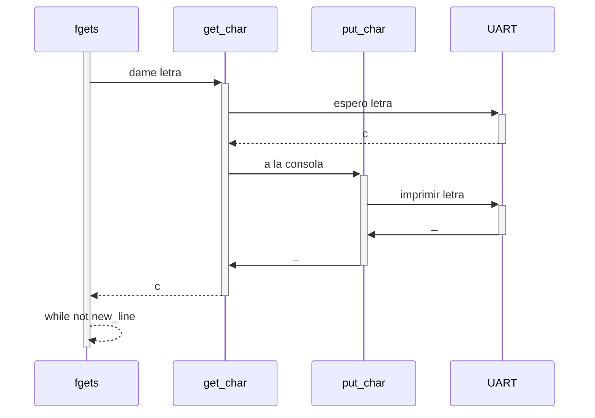

# Installation (OSX)
* The project uses `CMake` for management.
    * The CMAKE is customized for `AVR Atmega128` micro-controller.
* Needs:
    * `brew install cmake avr-gcc avrdude`
    * For serial comms: [CP210x USB to UART Bridge VCP Drivers](https://www.silabs.com/products/development-tools/software/usb-to-uart-bridge-vcp-drivers)
* Recommended but not needed:
    * `brew install platformio`

# Decisions
* Tried to make C++17 code but I wasn't able to do it because of this issues:
    * No support for `std::` in `gcc-avr`: this makes simple things like working with streams not supported by default.
    * No support for `FDEV_SETUP_STREAM` to allow usage of `<stdio.h>` functions.
    * No support for `std::variant` for better state-machines.
* `src/driver` folder contains all drivers.
* `src/core/common.h` contains helper macros for bit operations.
* `src/apps` folder contains some examples `ex_**` and the tps`tp_**`.
* `doc/` contains board documentation.

# Apps
## TPs

### tp_01(): GPIO - RTI
 * The button drivers maintains the history of a word (`uint8_t`) of the last bits.
    * This allows proper debouncing of physical inconsistencies for any type of button.
    * Allows handling of press and release events.
 * quick-press a button to change duty_cycle (dim the led)
 * long-press a button to change frequency (blink)
 * It's implemented using two Timers and the Atmega128 feature
 * of OutputCompare Modulator (OCM1C2) to mix the two into one signal
 * OC1C 16 bit timer is used for blinking. Mode: Fast PWM (non-inverting)
 * OC2 8 bit timer is used for dimming. Mode: Fast PWM (inverting)
 * Serial events showing what has happened:
 ```shell script
LONG PRESS (378696 c): changed frequency to 8Hz
QUICK PRESS (8084 c): changed duty_cycle to 50%
LONG PRESS (402930 c): changed frequency to 1Hz
QUICK PRESS (22010 c): changed duty_cycle to 94%
QUICK PRESS (22057 c): changed duty_cycle to 0%
LONG PRESS (316915 c): changed frequency to 2Hz
LONG PRESS (333678 c): changed frequency to 8Hz
QUICK PRESS (18483 c): changed duty_cycle to 50%
QUICK PRESS (22653 c): changed duty_cycle to 94%
QUICK PRESS (19914 c): changed duty_cycle to 0%
QUICK PRESS (31178 c): changed duty_cycle to 50%
QUICK PRESS (26451 c): changed duty_cycle to 94%
```

#### Button Implementation



 
### tp_02(): UART
 * Based on tp_01 code for button/light interaction.
 * Renamed `set_freq` with `chg_freq` to be more descriptive.
 * Added `set_dc` to allow changing duty-cycle presets in serial.
 * The system only blocks when entering input via serial.
    * If not should work like tp_01.
 * The entire string of the command is not checked to enhance performance.
 * Added nice visualization of the entire app state.
 * Added usage on "unknown_command error"
 * Available errors in `Error_t` typedef
```shell script
i Frequency	Duty-cycle
0 >     1Hz	      0%
1       4Hz	>    50%
2       8Hz	     90%
echo_mode is ON
Type a command:
Error[-1]: Unknown command '', Usage:
  echo             echo-mode on/off.
  get_state        prints current freq & dc.
  chg_freq[0..2]   changes frequency within 3 presets in Hz.
  chg_dc[0..2]     changes duty-cycle whithin 3 presets in %.
  set_dc[0..100]   changes current duty-cycle to other %.
```
### tp_03(): ADC
 * Using AREF for VCC and GROUND from ADC section. (Measured at `2.471V`)
 * Using a capacitor would reduce noise.
 * printf of floats is not implemented in avr-c library. Using printf with `/` & `%` instead.
 * Added 10k resistor next to NTC thermistor.
 * adc_read allows any channel to be read
    * Using conversion wait until ADSC is zero again.
 * For temeprature conversion used the [beta parameter equation aproximation](https://en.wikipedia.org/wiki/Thermistor#B_or_.CE.B2_parameter_equation)
    * `B` value calibrated with multimeter's thermal probe for provided thermistor

## Examples
### ex_blink()
* Simple blink

### ex_button();
* Simple button driver test.
* Pressing button turns on/off led
* Also some serial events are shown including long-presses

### ex_serial();
* Simple serial driver test.

### ex_timers();
* Simple pwm timers example with lights and serial events.


# Windows (not tested) requirements
- Compiler: AVR
- WinAVR: Makefile
- USBASP [HW]
- AURDUDE
